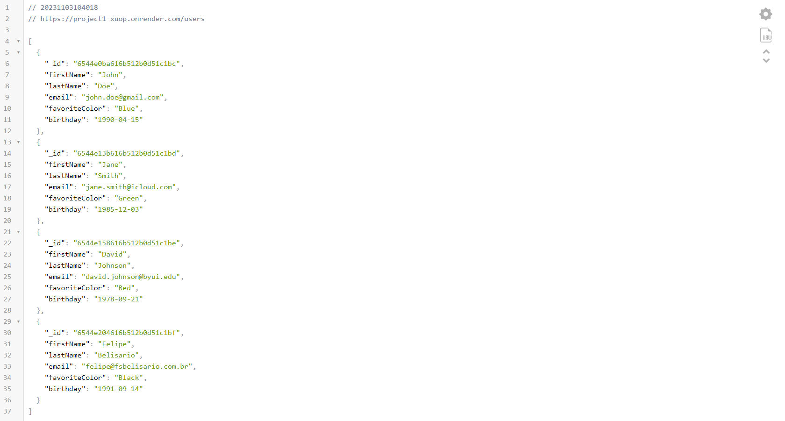
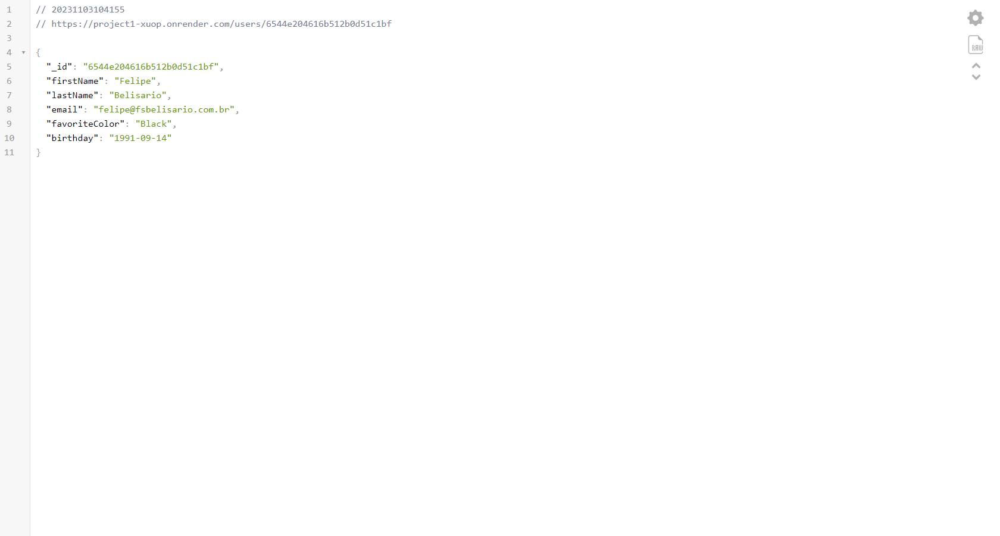

# Contacts Project: Part 1

## Overview
This project focuses on creating an API for storing and retrieving information about contacts. These contacts are stored in a MongoDB database and all interaction happens through the API. This is a two-week project, and this README covers the progress made in Week 01.

## Technologies Used
We are using **Node.js**, **MongoDB**, and **Express** for task implementation. 

## Installation
To test the code, you need to install the following dependencies:

1. Node.js
2. MongoDB
3. Express

You can install them using npm (Node Package Manager):

\`\`\`bash
npm install express mongodb
\`\`\`

## Progress in Week 01
In the first week, the following tasks were completed:

1. Set up the project and database.
2. Imported data into the database.
3. Completed the GET API routes (get and get all).
4. Deployed the app to Render.

Here is a screenshot of the two endpoints working as expected:

## Next Steps
In Week 02, the app will be finished by adding in the POST, PUT, and DELETE endpoints as well as the API Documentation.
