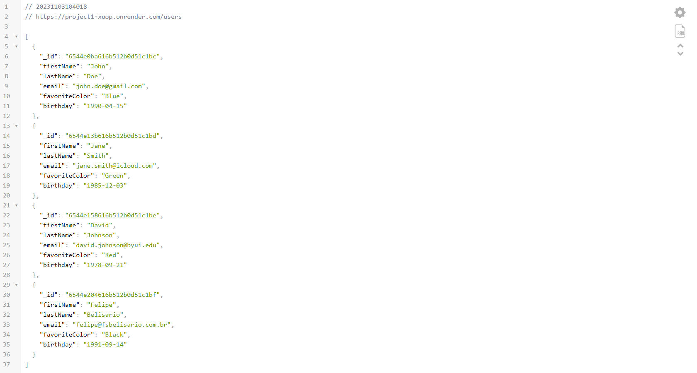
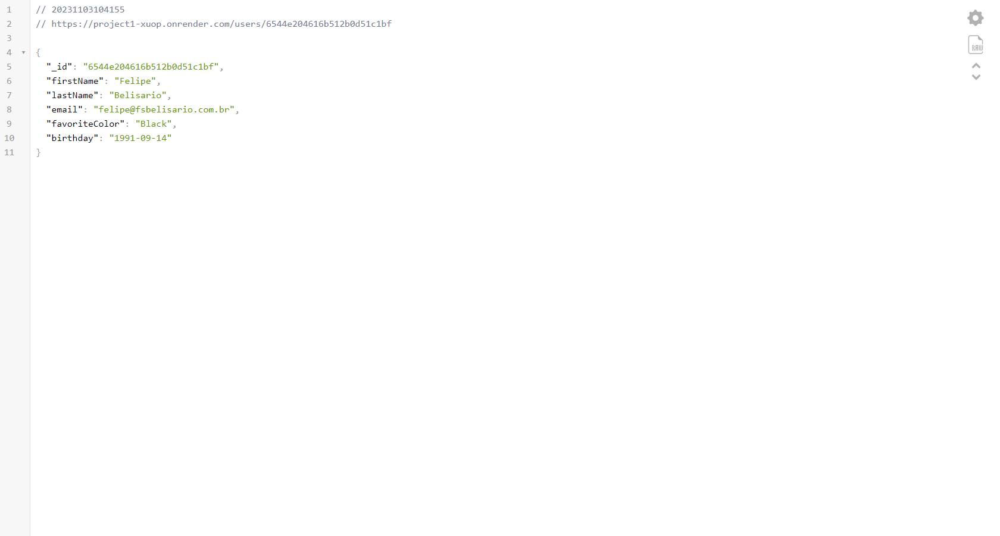

# Contacts Project: Part 1

## Overview
This project focuses on creating an API for storing and retrieving information about contacts. These contacts are stored in a MongoDB database, and all interaction occurs through the API. This README covers the progress made during Week 01.

## Technologies Used
I am utilizing **Node.js**, **MongoDB**, and **Express** for task implementation.

## Installation
To test the code, you need to install the following dependencies:

1. Node.js
2. MongoDB
3. Express

You can install them using npm (Node Package Manager):

\`\`\`bash
npm install express mongodb
\`\`\`

## Progress in Week 01
In the first week, I successfully completed the following tasks:

1. Project setup and database initialization.
2. Data import into the database.
3. Implementation of GET API routes for retrieving individual contacts and all contacts.
4. Deployment of the application to Render.

Here's a summary of the GET API routes that were implemented:

- **Get All Contacts**: Retrieve a list of all contacts.
- **Get a Single Contact by ID**: Retrieve a specific contact by providing the contact's ID.

Here is a screenshot of the two endpoints working as expected:

To test these routes, I created an `api.rest` file that allows for easy route testing. You can find the file in the project's root directory. It defines the routes for testing your API locally.

## Using the `api.rest` File
To utilize the `api.rest` file, follow these steps:

1. Open the `api.rest` file in Visual Studio Code.

2. Ensure your local server is running.

3. Click on the "Send Request" button for the desired route to test it against your local server.

This file simplifies the process of testing your routes and verifying their functionality.

## Demo
For a demonstration of the API in action, please watch the video on [YouTube](https://youtu.be/o2lT6DDJmfM).

## Access the API
You can access the API deployed on Render by visiting [API on Render](https://project1-xuop.onrender.com/users).

## Next Steps
In Week 02, I will complete the project by adding the following functionality:

- POST endpoint for creating new contacts.
- PUT endpoint for updating existing contacts.
- DELETE endpoint for removing contacts.
- API Documentation for detailed usage instructions.

Stay tuned for further updates and enhancements to the Contacts Project in Week 02.
