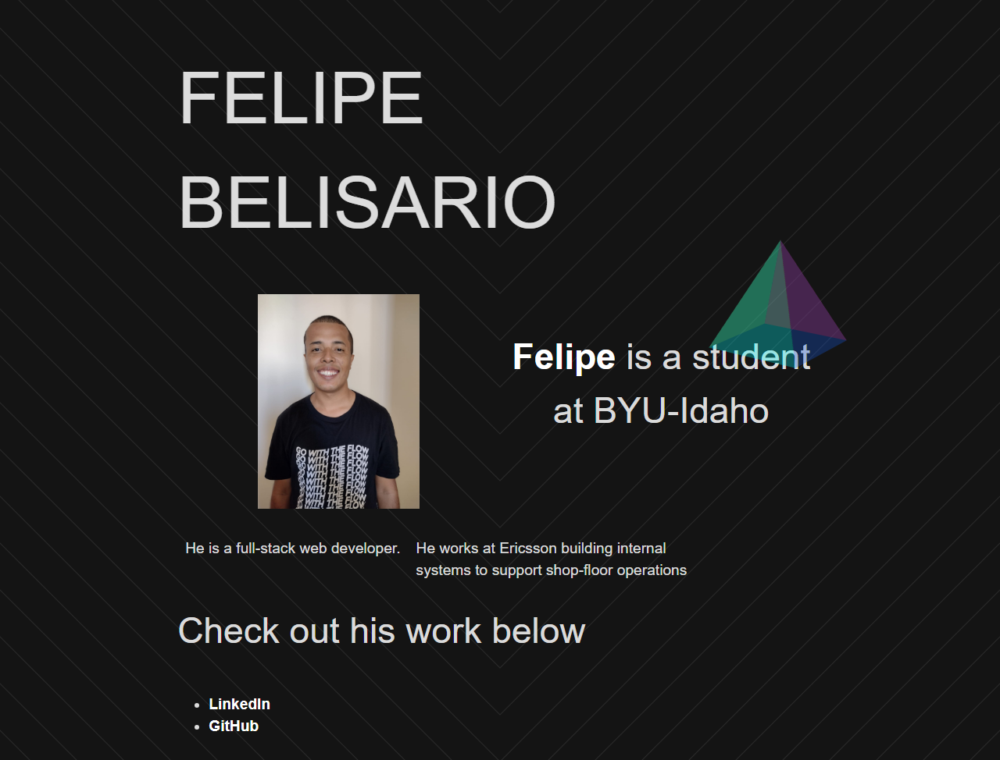

# Individual Activity: Develop an API for an Existing Frontend

This repository contains my solution for the individual activity assigned in our course. The task was to develop a backend API for an existing frontend.

## Overview

The purpose of this activity was to gain hands-on experience in developing a backend API and connecting it with a frontend. The frontend code was provided, and the task was to create a backend that could serve the necessary data to the frontend.

## Steps Taken

1. Downloaded the provided frontend code.
2. Created a new Node.js project using `npm init`.
3. Developed a server with a REST endpoint to GET all data required by the frontend.
4. Tested the API endpoints using a REST Client to ensure they were working correctly.
5. Connected the API to MongoDB and retrieved data from the database (Stretch Challenge).

## Testing

After developing the API endpoints and ensuring they were working correctly with a REST Client, I opened the frontend webpage in the browser and checked to see if it was working. The backend server was running on port 8080 during this process.

## Result

The final result of this activity is a fully functional web application with a frontend that displays data served from my custom backend API. Below is a screenshot of the application running:

## Conclusion

This activity provided valuable experience in developing backend APIs and connecting them with a frontend. It also served as good practice for working with Node.js, Express, and MongoDB.
